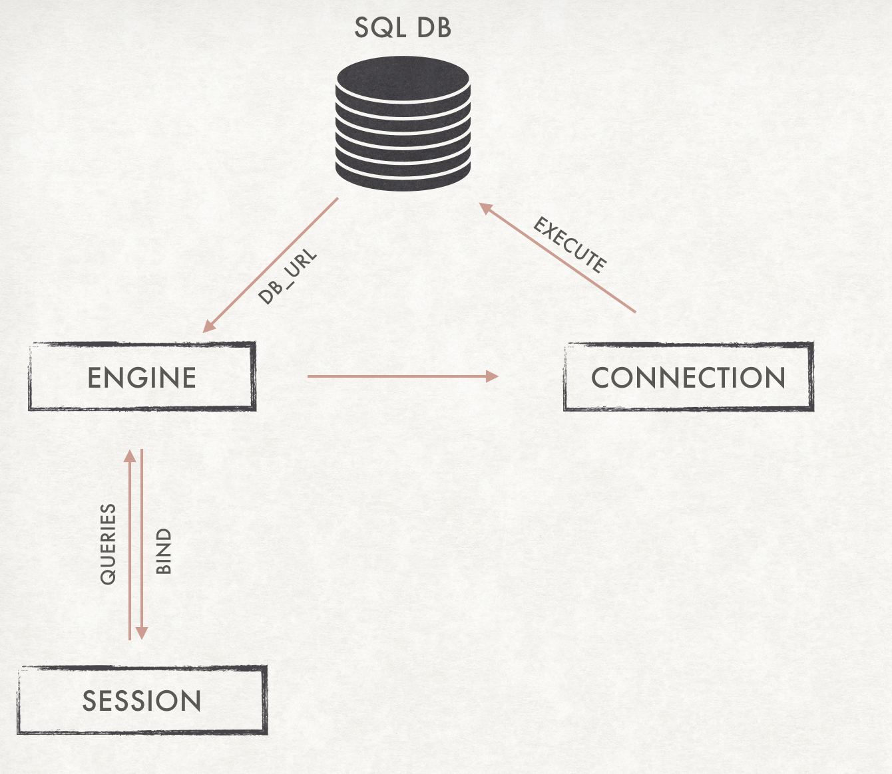

# SQLAlchemy 
This repository is created to showcase the task provided by Martin Glauer. 
## **Tasks:**

    1. Create a database schema using SQLAlchemy that can store the data provided in the file. 
    2. A function that reads the file and stores the data in the tables from 1. Hint: This function should be able to handle large datasets (several GB) without flooding my RAM ;)
    3. A function that queries the database for all students that got grade  1.0 in at least 3 classes and prints all results (In the example file that  would be  Milana)

## Requirements :

### Packages

 - To run the above code PostgreSQL and psycopg2 are required to create a database. 
- SQLAlchemy 
- Python 3

### Files
- A CSV file that contains the data which has to be added to the database on which the query is carried out. 
- A database in the PostgreSQL server

### Usage : 

    python main.py  -h --db_name DB_NAME --csv_file_path CSV_FILE_PATH

#### Example : 

    python main.py --db_name tasks --csv_file_path test_data_files/task.csv

SQLAlchemy Task code

    optional arguments:
      -h, --help            show this help message and exit
      --db_name DB_NAME "Database name to be connected"
      --csv_file_path CSV_FILE_PATH "File path of the CSV dataset"

DB_NAME is the database that has been created in the Postgres server to which the user wants to connect for further processing. 

## Procedure

### Intro 
An image that explains the reason for the usage of the SQLAlchemy. It creates a connection between the program and the database for interaction. The Object Relational Mapping functionality helps to code in python without the hassle as in raw SQL and be more pythonic. 

### Database 

As mentioned in the task, the databse schema was created using the SQLAlchemy in the file named schema.py. It was defined by creating a class for a table in the database and defining the columns by its name and data types. The auto_increment functionality of the primary key was also implemented with Sequence function in SQLAlchemy for the PostgreSQL database. 

    class Task(Base):
    
        __tablename__ = 'task_table'
        id = Column(Integer, TABLE_ID , primary_key=True , server_default=TABLE_ID.next_value() )
        name = Column(String)
        grade = Column(Float)
        courses = Column(String)

This solves the task 1. 

To solve the tasks I created two solutions. 

1. Using SQLite to process small datasets that can be run without creating a server. I wanted to create an initial working prototype so I chose to develop in the Colab notebook environment. 
2. The second solution was to create a server locally using PostgreSQL. PostgreSQL provides a dashboard to manage the databases creates the transactions on persistent memory and clears the RAM.  

The SQLite implementation is provided in the Colab notebook version. The PostgreSQL version is provided in the src folder. The usage of this folder is provided above. 

### Read dataset

- The parsing is done by in built CSV reader object in python. It is implemented in the file named insert_data_db.py.  
- The parsing of the CSV dataset is done using CSV reader module instead of using Pandas. Due to the objective that there is no manipulation to be done on the dataset and this also eliminates the overhead caused by Pandas. 
- The csv.reader is an iterator that read the rows one by one and not clogging the whole memory.
- The function named write_data_to_database() implements this function. 

*code snippet for reading*
  

     with open(file_path,'r') as f :
            reader = csv.reader(f, delimiter=',') # An iterator object
            next(reader) #skipping the header
            print("CSV File parsed")
            for row in reader:  # reading the rows one by one for efficiency
            

### Insert data to Database 

- This is implemented in the file named insert_data_db.py under the function write_data_to_database(). 
- The data is read one by one from the reader instance from the CSV reader. This will not hold up a lot of RAM during the runtime.
- This functionality is enhanced by the bulk insert in sqlalchemy. Altogether not holding up the primary memory. 
- Using the ORM functionality in SQLAlchemy of bulk insert, the addition of data to the database can be optimised by sending bulk data at a point in time. And then committed to the database. 
- This can be carried out for memory efficiency. 

*code snippet for insertion into database* 

    # appending the table objects to the list 
    object.append(Task(
                name = row[0],
                grade = row[1],
                courses = row[2]
                ))
    # For small files
    if lines == numline-1:
        session.bulk_save_objects(object)
        session.commit()
        print("Data Added")
        break
    
    # For large files insert after 1000 reads
    elif lines % 1000 == 0 :

        session.bulk_save_objects(object)
        session.commit()
        print("Number of lines added : {}".format(lines))

        object = []
- The read and insert solves the task 2. 

### Query

- The query is implemented in the file named query.py under the function named custom_query(). 
- The logic is to select the names and the count of the courses which is filtered by their respective grades where it is equal to 1.0 and it is grouped by their names where the count of the courses is at least 3.0. 

*code snippet for query*

	session.query(func.count(database_class.courses),database_class.name).filter_by(grade=1.0).group_by(database_class.name).having(func.count(database_class.courses)>= 3.0)` 
        

### Observations 

I have attached the usage of the RAM while doing a one by one addition of the user to the database and by doing a bulk insertion to the database. 

**One by one insertion**

**Bulk insertion** 

By doing a bulk insertion the usage of the RAM is reduced during the insertion to the database. 

The usage of the PostgreSQL was useful in creating a local server and having a user interface to deal with the database. 
The following image indicates the raw SQL statement on the pgAdmin interface. 

The insertion of large datasets more than 5 million lines of data takes a significantly longer time but the memory usage due to line by line process and bulk insert. 

The results on the experiment runs have been attached in the [Test images folder](test_images/test_screenshots)

### Future Work 
- Reading the file in chunks and processing the chunks to efficiently use the memory. 
- Finding an optimal number for bulk insertion based on memory availability. 
- Looking for other ideas to better the approach. 

### References 
- [PyPI project](https://pypi.org/project/SQLAlchemy/)
- [SQLALchemy tutorial point](https://www.tutorialspoint.com/sqlalchemy/index.html)
- [https://towardsdatascience.com/sqlalchemy-python-tutorial-79a577141a91](https://towardsdatascience.com/sqlalchemy-python-tutorial-79a577141a91)
- [(https://leportella.com/sqlalchemy-tutorial.html](https://leportella.com/sqlalchemy-tutorial.html)
- and a lot more stackoverflow pages which I lost track of after sometime. 

